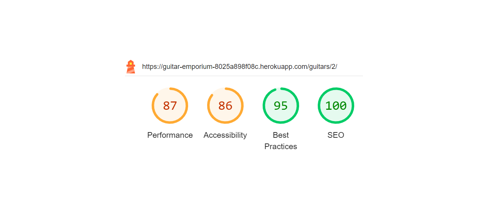

# Testing.
## Manual Test.
### Responsivenes.
The site were tested to ensure responsiveness on screen sizes from 320px and upwards on Chrome and Edge.
### Steps to test:
1. Open browser and navigate to [Guitar Emporium](https://guitar-emporium-8025a898f08c.herokuapp.com/).
2. Open the developer tools (right click and inspect)
3. Set to responsive and decrease width to 320px
4. Set the zoom to 50%
5. Click and drag the responsive window to maximum width
### Expected:
Website is responsive on all screen sizes and no images are pixelated or stretched. No horizontal scroll is present. No elements overlap.
### Actual:
Website is responsive on all screen sizes and no images are pixelated or stretched. No horizontal scroll is present. No elements overlap.
### Website was also opened on the following devices and no responsive issues were seen:
* Samsung S22
* Iphone 13
* Lenovo ideapad S340

## Site Testing.
The site has been tested to ensure that users can add, change and delete without problems, without error messages. 

### 1. Test as anonymous user.
Steps to test:
1. Navigate to [Guitar Emporium.](https://guitar-emporium-8025a898f08c.herokuapp.com/) 
2. Home Page:
   1. Click: All the navlinks.
        1. Title - Satisfactory
        2. Home - Satisfactory
        3. Guitars - Satisfactory
        4. My Account - Satisfactory
        5. Cart - Satisfactory
3. Click "Guitars"
   1. Enter searchfield: "Blue"
        - 2st results
    2. Enter searchfield: "Test"
        - 3st results
        - Added guitar with name: Test is displayed
    3. Sort
        1. Price (low to high) - Satisfactory
        2. Price (high to low) - Satisfactory
        3. Name (A-Z) - Satisfactory
        4. Name (Z-A) - Satisfactory
4. Buy a Guitar:
    1. Click on a image
    2. View a Review
    3. Add to Cart
5. Go to Cart:
    1. Update quantity
    2. Remove Item
    3. Do step 4.1 to 4.3 again
6. Click "Secure Checkout"
    1. Fill in information
    2. Complete the purchase
7. Do steps 1.0 to 6.2 again in mobile view.
 

### 2. Test as loggedin user.

Steps to test:
1. Navigate to [Guitar Emporium.](https://guitar-emporium-8025a898f08c.herokuapp.com/) 
2. Home Page:
   1. Click: All the navlinks.
        1. Title - Satisfactory
        2. Home - Satisfactory
        3. Guitars - Satisfactory
        4. My Account - Satisfactory
        5. Cart - Satisfactory
3. Click "Guitars"
   1. Enter searchfield: "Blue"
        - 2st results
    2. Enter searchfield: "Test"
        - 3st results
        - Added guitar with name: Test is displayed
    3. Sort
        1. Price (low to high) - Satisfactory
        2. Price (high to low) - Satisfactory
        3. Name (A-Z) - Satisfactory
        4. Name (Z-A) - Satisfactory
4. Buy a Guitar:
    1. Click on a image
    2. Add to Wishlist - Heart symbol is red
        1. Follow step 7.
        2. Make sure a new item is added in Wishlist
        3. Go back to Wishlisted Guitar.
    3. Remove from Wishlist - heart symbol is transparent
        1. Follow step 7.
        2. Make sure the item is removed from Wishlist
        3. Go back to Guitar.
    4. View a Review
    5. Add a Review
    6. Add to Cart
5. Go to Cart:
    1. Update quantity
    2. Remove Item
    3. Do step 4.1 to 4.3 again
6. Click "Secure Checkout"
    1. Fill in information
    2. Complete the purchase
7. Go to Profile under My Account
    1. View Order history
    2. View Wish listed items

8. Do steps 1.0 to 7.2 again in mobile view.
 

### Test as a superuser.

Steps to test:
1. Navigate to [Guitar Emporium.](https://guitar-emporium-8025a898f08c.herokuapp.com/) 
2. Home Page:
   1. Click: All the navlinks.
        1. Title - Satisfactory
        2. Home - Satisfactory
        3. Guitars - Satisfactory
        4. My Account - Satisfactory
        5. Cart - Satisfactory
3. Click "Guitars"
   1. Enter searchfield: "Blue"
        - 2st results
    2. Enter searchfield: "Test"
        - 3st results
        - Added guitar with name: Test is displayed
    3. Sort
        1. Price (low to high) - Satisfactory
        2. Price (high to low) - Satisfactory
        3. Name (A-Z) - Satisfactory
        4. Name (Z-A) - Satisfactory
    4. Edit Guitar
        1. Change all the fields
        2. Click update
        3. Info message is displayed
    5. Delete Guitar
        1. Click Delete
        2. popup message is displayed
            1. Press cancel and the procedure is cancelled.
            2. Press yes and the product is deleted
        3. Info message says that a product is deleted
4. Go to Guitar Details:
    1. Click on a image
    2. Add to Wishlist - Heart symbol is red
        1. Follow step 7.1.
        2. Make sure a new item is added in Wishlist
        3. Go back to Wishlisted Guitar.
    3. Remove from Wishlist - heart symbol is transparent
        1. Follow step 7.1.
        2. Make sure the item is removed from Wishlist
        3. Go back to Guitar.
    4. View a Review
    5. Add a Review
    6. Edit Guitar
        1. Change all the fields
        2. Click update
        3. Info message is displayed
    7. Delete Guitar
        1. Click Delete
        2. popup message is displayed
            1. Press cancel and the procedure is cancelled.
            2. Press yes and the product is deleted
        3. Info message says that a product is deleted
    8. Add to Cart
5. Go to Cart:
    1. Update quantity
    2. Remove Item
    3. Do step 4.1 to 4.3 again
6. Click "Secure Checkout"
    1. Fill in information
    2. Complete the purchase
7. Go to My Account
    1. Click Profile
        1. View Order history
        2. View Wish listed items
    2. Click Product Management
        1. Fill in the form to add a new product
        2. View the new product by clicking guitars in the navbar

8. Do steps 1.0 to 7.2 again in mobile view.
 

### Create, modify and delete as a non-authorized user.
1. Input: /guitar/edit/2/
    * Result: Error message, redirect to home.
2. Input: /review/add_review/2/
    * Result: redirect to login.
3. Input: /guitars/delete/7/
    * Result: Error message, redirect to home.
4. Input: /guitars/add/
    * Result: Error message, redirect to home.
5. Input: /profile/
    * Result: redirect to login.
### Expected:

The expectation has been that the site works as it should without broken links and that the user receives feedback in all situations and that unauthorized users cannot get in the back way and change or add data.

### Actual:
The site works as expected

- I chose to use only one static file with css and the test result was: [(Jigsaw) validator](https://jigsaw.w3.org) 
   

- Testing JavaScript was a bit tricky because a lot of the script is at the bottom of the respective html file, I got some errors but they appear because of my comments.[Jshint linter](https://jshint.com/) 
 

# Page Testing

## Home page.

Home page testing.

The HTML Templates associated with the Home page are:

* base.html
* mobile-nav.html
* index.html

I tested what links are available from the home page. 

| Auth Status | Register | Login | Logout | Guitars | Footer | Profile Access | Product Management | Custom | cart |
|-------------|----------|-------|--------|---------|--------|----------------|--------------------|-----|--|
| Admin   | no/pass | no/pass | yes/pass | yes/pass | yes/pass | yes/pass| yes/pass | yes/pass | yes/pass |
| Registered User | no/pass | no/pass | yes/pass | yes/pass | yes/pass   | yes/pass | yes/pass | yes/pass | yes/pass |
| Anonymous User  | yes/pass     | yes/pass  | no/pass    | yes/pass       | yes/pass   | no/pass | no/pass | yes/pass | yes/pass |

### Lighthouse Testing.
 

### HTML validator.

### Guitar page.

Guitars page testing.

The HTML Templates associated with the guitars page are:

* base.html
* mobile-nav.html
* guitars.html

I tested what links are available from the guitars page. 

| Auth Status | Register | Login | Logout | Guitars | Footer | Profile Access | Product Management | Custom | Cart | Guitar detail | Edit | Delete |
|-------------|----------|-------|--------|---------|--------|----------------|--------------------|-------|---|----|---|----
| Admin   | no/pass | no/pass | yes/pass | yes/pass | yes/pass | yes/pass| yes/pass | yes/pass | yes/pass | yes/pass | yes/pass | yes/pass
| Registered User | no/pass | no/pass | yes/pass | yes/pass | yes/pass   | yes/pass | yes/pass | yes/pass | yes/pass |yes/pass | no/pass | no/pass
| Anonymous User  | yes/pass     | yes/pass  | no/pass    | yes/pass       | yes/pass   | no/pass | no/pass | yes/pass | yes/pass | yes/pass | no/pass | no/pass

### Lighthouse Testing.
 

### HTML validator.

 

### Guitar details page.

Guitar details page testing.

The HTML Templates associated with the guitars details page are:

* base.html
* mobile-nav.html
* guitar_detail.html

I tested what links are available from the guitars details page. 

| Auth Status | Edit | Delete | Leave review | Add to wishlist | Add to cart | View review | +/- quantity |
|-------------|------|--------|--------------|-----------------|-------------|--------------|---------|
| Admin   | yes/pass | yes/pass | yes/pass | yes/pass | yes/pass | yes/pass| yes/pass |
| Registered User | no/pass | no/pass | yes/pass | yes/pass | yes/pass   | yes/pass | yes/pass |
| Anonymous User  | no/pass     | no/pass  | no/pass    | no/pass       | yes/pass   | yes/pass | yes/pass |

### Lighthouse Testing.
 

### HTML validator.

 

### Profile page.

Profile page testing.

The HTML Templates associated with the Profile page are:

* base.html
* mobile-nav.html
* profile.html

| Auth Status     | Order number | Update info | Message  |
|-----------------|--------------|-------------|----------|
| Admin           | yes/pass     | yes/pass    | yes/pass |
| Registered User | yes/pass     | yes/pass    | yes/pass  |
| Anonymous User  | n/a          | n/a         | n/a      |

### Lighthouse Testing.
 

### HTML validator.

 

### Cart page.

Cart page testing.

The HTML Templates associated with the Cart page are:

* base.html
* mobile-nav.html
* cart.html
* cart-total.html
* checkout-buttons.html
* guitar-image.html
* guitar-info.html
* quantity-form.html

| Auth Status     | Update   | Remove     | +/- Quantity  | Checkout | message |
|-----------------|----------|------------|---------------|----------|---------|
| Admin           | yes/pass | yes/pass   | yes/pass      | yes/pass | yes/pass|
| Registered User | yes/pass | yes/pass   | yes/pass      | yes/pass | yes/pass|
| Anonymous User  | yes/pass |  yes/pass  | yes/pass      | yes/pass | yes/pass|

### Lighthouse Testing.
 

### HTML validator.

 
When I tested this page I got quite a few warnings, this is because I copied from boutique_ado.

 

### Checkout page.

Home page testing.

The HTML Templates associated with the Checkout page are:

* base.html
* mobile-nav.html
* checkout.html
* checkout_success.html

| Auth Status     | Complete order | login     | Create an account | message |
|-----------------|----------------|-----------|-------------------|---------|
| Admin           | yes/pass       | no/pass   | no/pass           | yes/pass|
| Registered User | yes/pass       | no/pass   | no/pass           | yes/pass|
| Anonymous User  | yes/pass       |  yes/pass | yes/pass          | yes/pass|

### Lighthouse Testing.
 

### HTML validator.

 

### Custom page.

Custom page testing.

The HTML Templates associated with the Custom page are:

* base.html
* mobile-nav.html
* custom.html

### Lighthouse Testing.
 

### HTML validator.

 

### Order history page.

Order history page testing.

The HTML Templates associated with the order history page are:

### Lighthouse Testing.
 

### HTML validator.

 

### Flake8 python validation
 
When I have done my python validation, I get a lot of errors, although most of the errors come from allauth. After a lot of work, there are no errors left in my own code.

### Stripe testing.
 
Now everything is written in Swedish, but the picture describes that:
* API requests:
    * Successful - 42
    * Failed - 0
* Webhooks:
    * Successful - 40
    * Failed - 9

The Failed webooks comes from my development enviroment, I have tested it through the live version with good result. 

### Testing Email verification.

To test that the email verification works, I have used Tempemail.com to be able to create several different accounts more easily. 

1. Create an account.
 
2. Go to your email and click on the link.
 
3. Click on confirm.
 
4. Oops! it looks like we already have forgotten our password! Click on forgot password link. 
5. Enter your email and click reset my password.
 
6. Go to your email and click on the link.
 
7. Enter your new password two times and try not to forget it this time.
 
8. Password has now been changed.
 
9. Click on My Account and then login to sign in.
 
10. Success!
 

[Get back to parent README file.](/docs/README.md)
